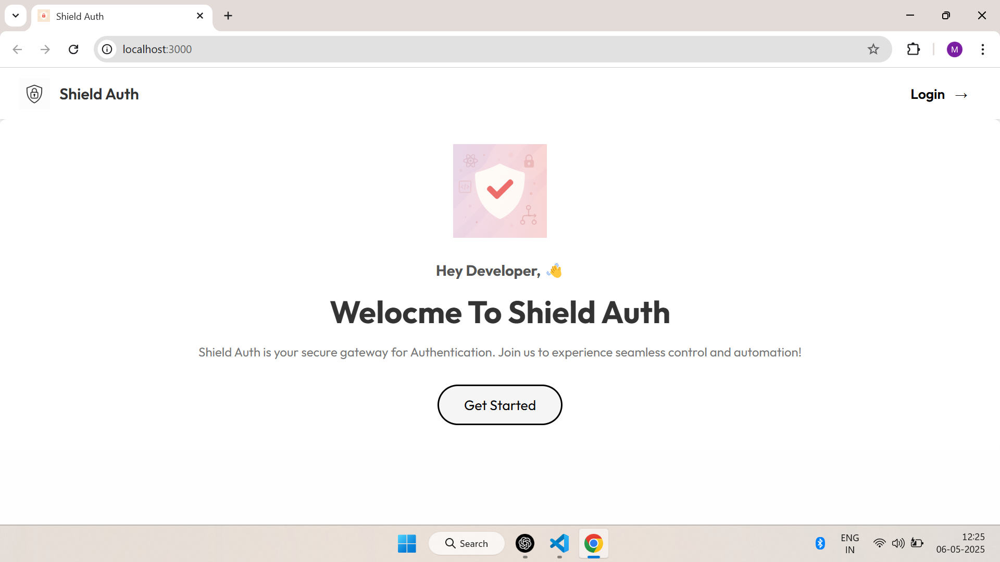

# Full Stack Authentication System with Spring Boot & React

This project demonstrates a complete authentication system using **Spring Boot** for the backend and **React.js** for the frontend. It includes user registration, login, JWT-based authentication, role-based access, and secure API integration.

## 🖼️ App Screenshot

## 🔧 Tech Stack

**Frontend:**
- React
- Axios
- React Router

**Backend:**
- Spring Boot
- Spring Security
- Spring Data JPA
- MySQL
- JWT (JSON Web Tokens)

## 🌟 Features

- User Registration & Login
- Password hashing with BCrypt
- JWT-based authentication
- Protected routes and API endpoints
- Token storage in HttpOnly cookies (optional)
- Full-stack integration (React ↔ Spring Boot)

